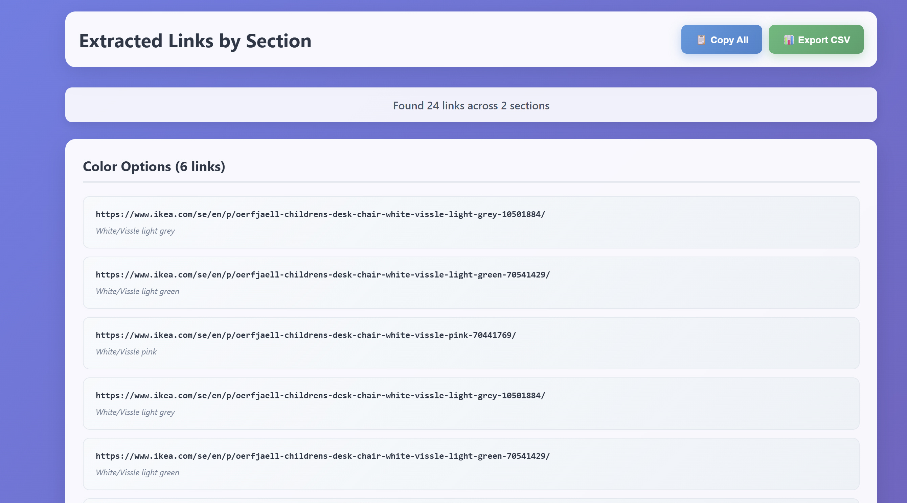

# ChatGPT All Links Bookmarklet

A powerful bookmarklet that extracts all links from ChatGPT conversations and presents them in a beautiful, organized interface.

## Features

- 🔗 **Extract All Links**: Automatically finds and extracts all links from ChatGPT conversations
- 📊 **Organized by Section**: Groups links by their containing sections based on headings
- 📋 **Copy to Clipboard**: One-click copy all links to clipboard
- 📈 **Export to CSV**: Export all links with their sections and titles to CSV format
- 🎨 **Beautiful Interface**: Modern, gradient-styled interface with hover effects
- 📱 **Responsive Design**: Works on all screen sizes

## Installation

1. Copy the entire JavaScript code from `chatgpt-all-links-bookmarklet.js`
2. Create a new bookmark in your browser
3. Set the bookmark name to "ChatGPT Links Extractor" (or any name you prefer)
4. Set the bookmark URL to the JavaScript code
5. Save the bookmark

## Usage

1. Navigate to any ChatGPT conversation
2. Click the bookmarklet from your bookmarks bar
3. A new tab will open showing all extracted links organized by section
4. Use the "📋 Copy All" button to copy all links to clipboard
5. Use the "📊 Export CSV" button to download links as a CSV file

## What Gets Extracted

The bookmarklet extracts:
- All hyperlinks from the conversation
- Link text and URLs
- Section context (which heading the link appears under)
- Total count of links found

## Browser Compatibility

Works with all modern browsers:
- Chrome/Edge (Chromium-based)
- Firefox
- Safari
- Opera

## Example Output

The bookmarklet creates a new tab with:
- Header showing total links found
- Links grouped by section
- Each link showing the URL and link text
- Visual indicators and hover effects

## Author

Created by **Ramin Babaeihemmati**  
[Connect on LinkedIn](https://www.linkedin.com/in/ramin-babaei-hemmati/)

## License

This project is open source and available for anyone to use and modify.

## Contributing

Feel free to submit issues or pull requests if you have suggestions for improvements!